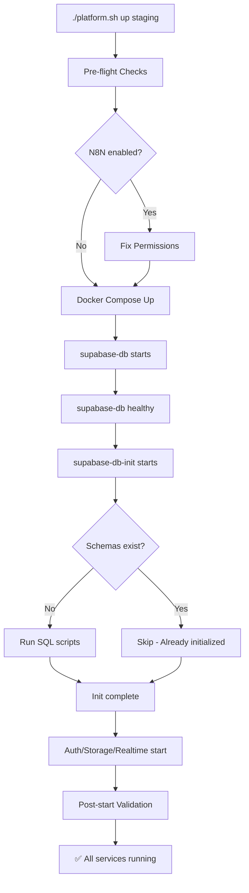

# Auto-Initialization System

Il sistema di auto-inizializzazione garantisce che `./platform.sh up` funzioni **al primo comando** senza interventi manuali, specialmente su server Linux.

## Problema Risolto

### Prima (Setup Manuale)

```bash
./install.sh staging
./platform.sh up staging
# ❌ Servizi Supabase crashano: "schema storage does not exist"
# ❌ N8N crasha: "EACCES: permission denied"

# Fix manuale richiesto:
./scripts/fix-supabase-schemas.sh staging
sudo chown -R 1000:1000 docker/n8n/data/
docker restart platform-staging-n8n
```

### Ora (One-Command)

```bash
./install.sh staging
./platform.sh up staging
# ✅ Tutto funziona automaticamente!
```

## Come Funziona

### 1. Init Container (Supabase)

**File**: `docker-compose.yml`

Aggiunto un container `supabase-db-init` che:

- Parte dopo che `supabase-db` è healthy
- Verifica se gli schema esistono già (idempotente)
- Se mancano, esegue gli script SQL:
  - `01-init-roles.sql` - Crea ruoli (anon, authenticated, service_role)
  - `00-init-schemas.sql` - Crea schema (auth, storage, realtime, etc.)
  - Scarica e applica migrazioni Storage da GitHub
- Si ferma dopo l'esecuzione (restart: "no")
- Gli altri servizi Supabase aspettano: `condition: service_completed_successfully`

**Caratteristiche**:
- ✅ **Idempotente**: Safe da eseguire multiple volte
- ✅ **Fast**: Skip se schema esistono già
- ✅ **Nativo Docker**: Nessuno script esterno
- ✅ **Atomic**: O completa tutto o fallisce chiaramente

### 2. Permission Auto-Fix (N8N)

**File**: `platform.sh` → `fix_n8n_permissions()`

Prima di avviare i container:

```bash
# Verifica owner della directory N8N
if owner != 1000; then
  # Usa sudo se disponibile, altrimenti chiede all'utente
  chown -R 1000:1000 docker/n8n/data/
fi
```

**Perché serve**:
- Container N8N gira come utente `node` (UID 1000)
- Su Linux, directory create con `mkdir` appartengono a root (UID 0)
- N8N prova a scrivere `/home/node/.n8n/config` → Permission Denied

### 3. Post-Start Validation

**File**: `platform.sh` → `post_start_validation()`

Dopo l'avvio verifica:

- Init container completato con successo (exit code 0)
- Servizi critici running
- Mostra warning se qualcosa è fallito

## Flow Completo



## Idempotenza

Il sistema è **safe da eseguire multiple volte**:

```bash
# Prima volta: Inizializza tutto
./platform.sh up staging

# Seconda volta: Skip init, avvia solo
./platform.sh down staging
./platform.sh up staging  # Fast, no init

# Con volumi puliti: Re-inizializza
./platform.sh clean staging
./platform.sh up staging  # Re-run init
```

## Debugging

### Verificare Init Container

```bash
# Stato init container
docker ps -a | grep supabase-db-init

# Logs dell'inizializzazione
docker logs platform-staging-supabase-db-init

# Exit code (0 = success)
docker inspect platform-staging-supabase-db-init --format='{{.State.ExitCode}}'
```

### Verificare Schema

```bash
# Connetti al database
docker exec -it platform-staging-supabase-db psql -U postgres -d postgres

# Verifica schema
\dn

# Dovrebbe mostrare:
# auth | storage | realtime | _realtime | graphql_public | public
```

### Verificare Permessi N8N

```bash
# Linux
stat -c '%u:%g' docker/n8n/data/
# Output atteso: 1000:1000

# macOS
stat -f '%u:%g' docker/n8n/data/
# Output atteso: 1000:1000
```

## Script di Validazione

Pre-flight check completo:

```bash
./scripts/validate-setup.sh staging
```

Verifica:
- ✓ Docker installato e running
- ✓ File .env esistente
- ✓ Script SQL presenti
- ✓ Permessi corretti (Linux)
- ✓ Porte disponibili

## Gestione Errori

### Init Container Fallisce

```bash
# Check logs
docker logs platform-staging-supabase-db-init

# Possibili cause:
# - Script SQL con errori di sintassi
# - Database non raggiungibile
# - Password PostgreSQL errata

# Fix:
# 1. Correggi il problema
# 2. Rimuovi init container
docker rm platform-staging-supabase-db-init
# 3. Riavvia
./platform.sh up staging
```

### Permission Fix Fallisce

```bash
# Se sudo non disponibile:
# - Esegui come root
# - O fix manuale: chown -R 1000:1000 docker/n8n/data/
```

## Compatibilità

### Linux Server ✅
- Init container: ✅ Funziona
- Permission fix: ✅ Necessario e applicato automaticamente

### macOS/Windows ✅
- Init container: ✅ Funziona
- Permission fix: ⚠️ Non necessario (Docker Desktop gestisce permessi)

### Docker Swarm / Kubernetes
- Init container: ⚠️ Usare init job nativo
- Permission fix: ⚠️ Usare initContainers o securityContext

## Performance

**Prima esecuzione** (con init):
```
./platform.sh up staging
→ ~30-40 secondi (include download migrazioni Storage)
```

**Successive esecuzioni** (skip init):
```
./platform.sh up staging
→ ~10-15 secondi (normal startup)
```

## Best Practices

1. **Sempre usare `./platform.sh up`** invece di `docker compose up` direttamente
2. **Controllare logs** dell'init container se i servizi Supabase falliscono
3. **Su CI/CD**: Assicurati che volumi siano puliti o usa cache
4. **In produzione**: Valuta di pre-inizializzare il database in fase di setup

## Riferimenti

- **Init Container**: `docker-compose.yml` → `supabase-db-init`
- **Permission Fix**: `platform.sh` → `fix_n8n_permissions()`
- **Validation**: `platform.sh` → `post_start_validation()`
- **Troubleshooting**: `TROUBLESHOOTING.md`
